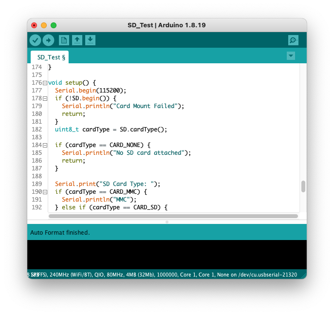
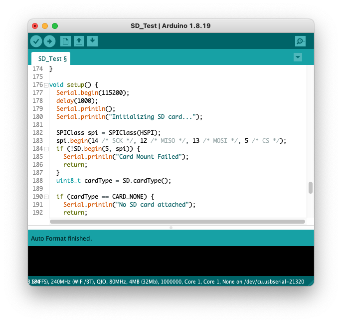

:repository-owner: domino4com
:repository-name: SD

[](https://github.com/domino4com/SD/actions/workflows/platformio.yml)
[](https://github.com/domino4com/SD/actions/workflows/arduino.yml)
image:https://github.com/{repository-owner}/{repository-name}/actions/workflows/spell_check.yml/badge.svg["Spell Check status", link="https://github.com/{repository-owner}/{repository-name}/actions/workflows/spell_check.yml"]


# Using the SD Card on The Extended Core (CWV)
Instead of listing a complete example here, you will find the code change to the existing SD Card Example in Arduino already. This way when the SD Card Example is updated, this example will not be outdated. It also very specific show what is different from the existing example.

## The Arduino Example
- Use a **micro** SD Card with 32Gb or less of capacity and insert into the CWV SD Card holder.
- Open the Example: File :point_right: Examples :point_right: SD (Under `Examples for ESP32`...) :point_right: SD_Test
- Find this line `if (!SD.begin()) {`
- And overwrite that line with this:

```C
  delay(1000);
  Serial.println();
  Serial.println("Initializing SD card...");

  SPIClass spi = SPIClass(HSPI);
  spi.begin(14 /* SCK */, 12 /* MISO */, 13 /* MOSI */, 5 /* CS */);
  if (!SD.begin(5, spi)) { 
```
### Notes
- I always add a 1 second delay so I don't miss anything in the Serial printout
- I always print an empty line, so my next line starts from a fresh line and not after the noise from the startup
- The CVW uses the HSPI (not the default VSPI). The standard pins on the HSPI is a per the code.
- The SD Card sits on GPIO5 as Chip Select (CS)

### Before


### After


